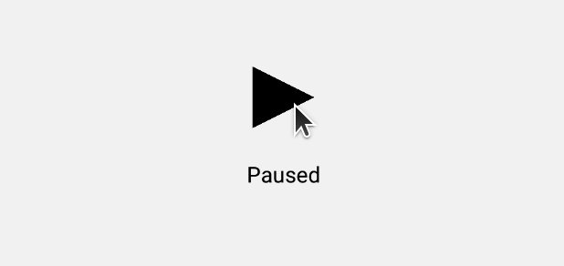

# React Native Animation Gesture Playground
Code of my playing around with react native gesture and animation 

## Animated Play Button

Using `borderWidth` technique to draw triangle, which use is not supported by native driver. So not very smooth, framedrops are noticeable.

- [ ] Consider using svg to draw triangle, so that native driver can be used.
- [ ] Make the animation all fully cyclic, so that the rotation never goes reverse.
